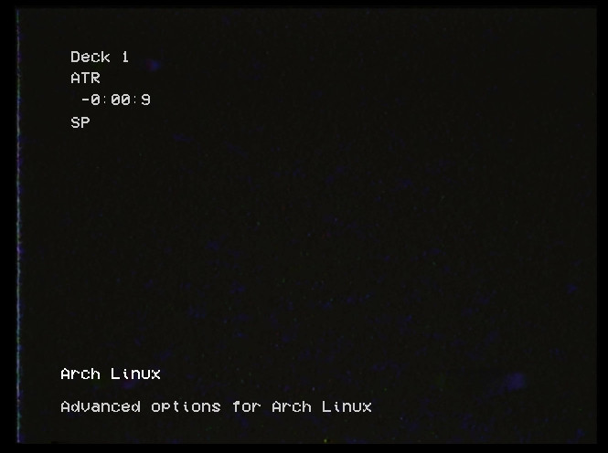
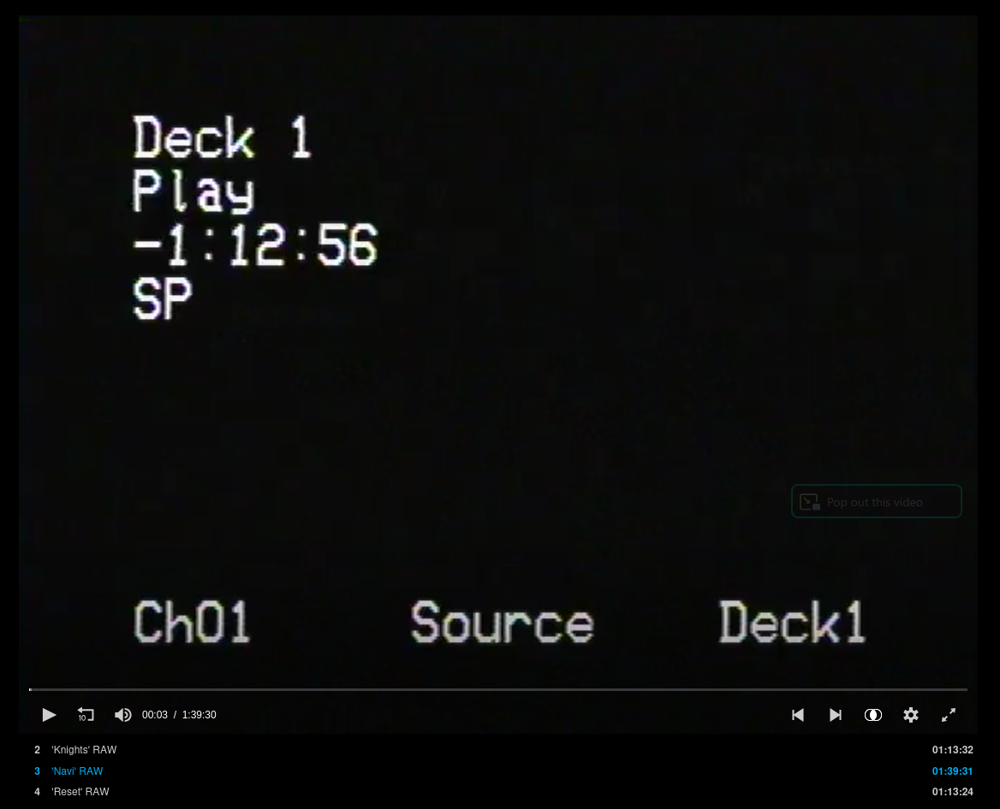

# gaussing-grub-theme

A GRUB bootloader theme inspired by VHS tape deck on-screen displays.

<!-- TODO: Eli's intro about watching Serial Experiments Lain VHS rips from the Internet Archive with his gf and how that inspired this project -->



## Inspiration

The on-screen display of a VHS deck — deck number, playback mode, timecode countdown, tape speed. The kind of thing you see burned into the corner of a VHS rip.



The boot countdown timer counts down in the timecode position, just like a VCR rewinding.

## Installation

```bash
git clone https://github.com/mojibake-dev/gaussing-grub-theme.git
cd gaussing-grub-theme

# Edit config.sh to your liking (font size, timeout, resolution, colors)
vim config.sh

# Install (requires root)
sudo ./install.sh

# Reboot to see it
sudo reboot
```

## Configuration

Edit `config.sh` before running the installer:

| Variable | Default | Description |
|----------|---------|-------------|
| `FONT_SIZE` | `36` | Font size in pt. Available: 16, 24, 32, 36, 48, 64 |
| `TIMEOUT` | `9` | Boot countdown in seconds |
| `GRUB_RESOLUTION` | `1280x720` | GRUB framebuffer resolution |
| `HUD_COLOR` | `#cccccc` | VCR HUD text color |
| `MENU_COLOR` | `#999999` | Unselected menu item color |
| `SELECTED_COLOR` | `#ffffff` | Selected menu item color |
| `DECK_LABEL` | `Deck 1` | Top-left deck label |
| `INSTALL_DIR` | `/boot/grub/themes/gaussing` | Theme install path |

### Font size guide

The font is baked into `.pf2` files at fixed pixel sizes. Lower GRUB resolution makes the same font appear larger:

| Resolution | Recommended size | Notes |
|-----------|-----------------|-------|
| 1920x1080 | 48 or 64 | Native 1080p, text may be small |
| 1280x720 | 36 | Good balance of size and clarity |
| 1024x768 | 24 or 32 | Large, chunky VCR text |
| 800x600 | 16 or 24 | Very large, classic CRT feel |

### Custom font sizes

If the included sizes don't work for you, generate your own from the included TTF:

```bash
# Requires grub-mkfont (part of grub-common)
grub-mkfont -s 42 -o fonts/vcr_osd_mono_42.pf2 fonts/VCR_OSD_MONO_1.001.ttf
```

Then set `FONT_SIZE=42` in `config.sh`.

## Secure Boot

If you have Secure Boot enabled, GRUB may block loading external font files. The theme layout and background will still render, but the VCR font may fall back to GRUB's built-in unicode font. Options:

- Disable Secure Boot (simplest)
- Build a custom GRUB standalone binary with the font embedded (`grub-mkstandalone --fonts=...`)
- Accept the fallback font (theme still looks good, just different typeface)

## Uninstall

```bash
sudo rm -rf /boot/grub/themes/gaussing
# Remove GRUB_THEME line from /etc/default/grub
sudo sed -i '/GRUB_THEME/d' /etc/default/grub
sudo update-grub
```

## Credits

- **VCR OSD Mono** font by [Riciery Leal](https://www.dafont.com/vcr-osd-mono.font) (free for personal use)
- VHS frame capture from [Serial Experiments Lain VHS rips](https://archive.org/details/lain_vhs/) on the Internet Archive
